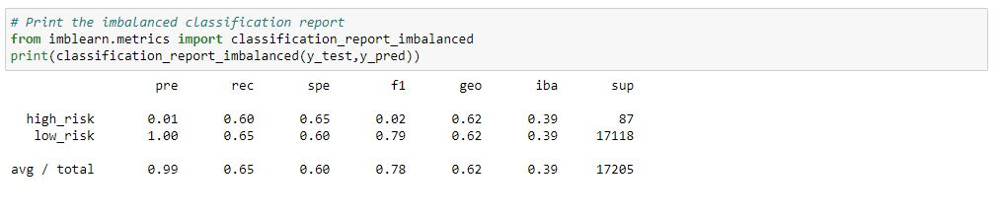
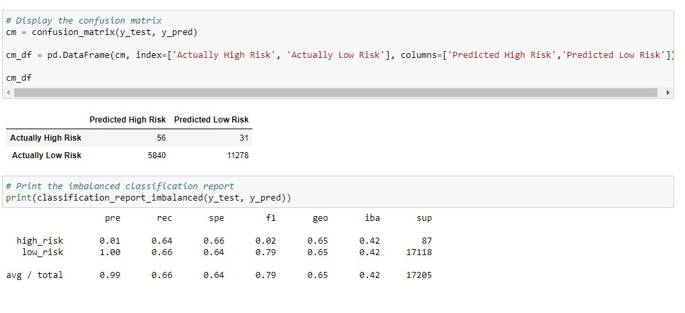
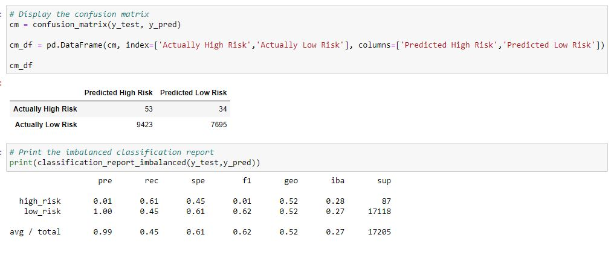
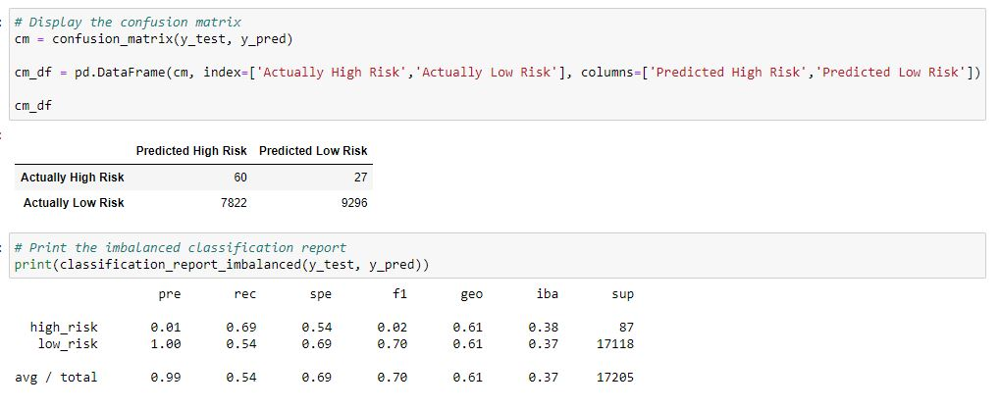
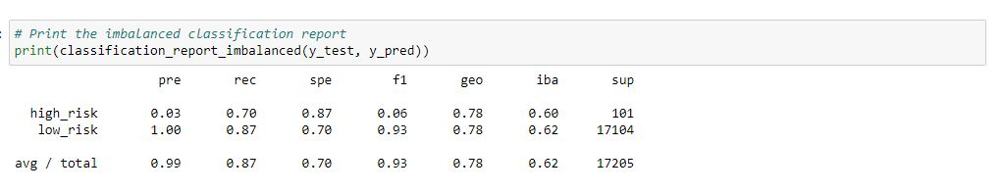
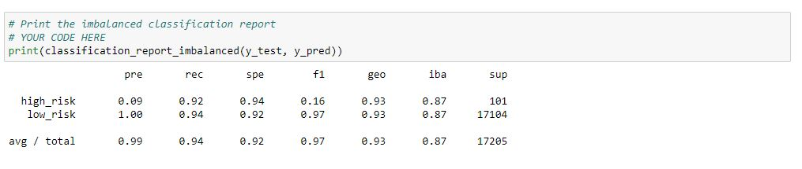

# Credit_Risk_Analysis

## Overview
* This analysis used machine learning algorithms in jupyter notebook to assess which method from among Naive Random Oversampling, SMOTE, Cluster Centroids, SMOTEENN, Balanced Random Forest Classifiers and Easy Ensemble Classifiers best predictors credit risk.

## Results
* Naive Random Oversampling:

    

* SMOTE:

    

* Cluster Centroids Algorithm:

    

* SMOTEENN:

    

* Balanced Random Forest Classifier:

    

* Easy Ensemble AdaBoost Classifier:

    

## Conclusions

* The Easy Ensemble AdaBoost Classifier performed the best at accurately categorizing high-risk applications with an accuracy score of 93%. The precision scores could be improved, meaning some loans which are not really high-risk are still being classified as such, but the Easy Ensemble algorithm nonetheless performs the best of the group tested here.